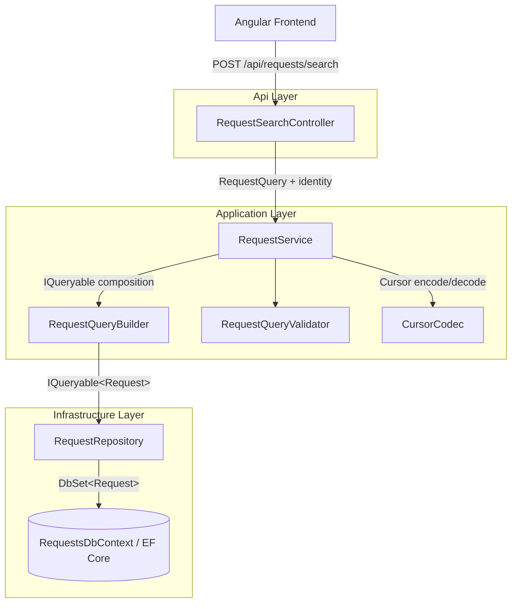
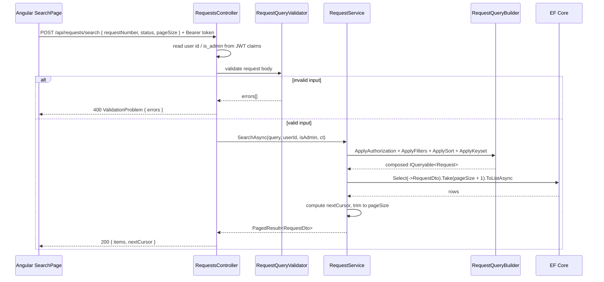
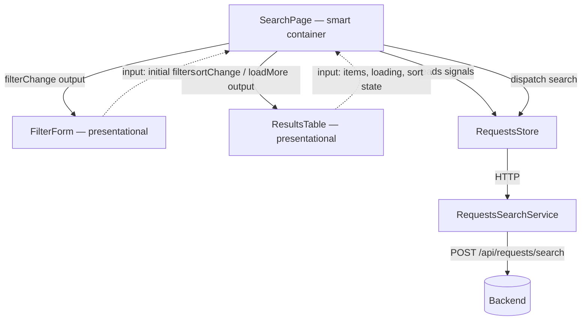

# Design Document

## Overview

This document describes the technical design for the **Requests Search and Filtering** feature, spanning the server (.NET 8 / ASP.NET Core / EF Core / Clean Architecture) and the client (Angular 20). The design extends the existing solution without changing its technology stack and replaces the current in-memory approach (loading all records and filtering with LINQ-to-Objects) with a single composed `IQueryable` executed at the database level, including query-side authorization and keyset-based pagination.

Guiding principles:

- **Push work down to the query** — filtering, authorization, sorting, and pagination are composed into a single `IQueryable` executed by the database. No `ToList` is called before the query is fully composed.
- **Authorization first** — the authorization predicate is always applied, before pagination, and cannot be bypassed through query parameters.
- **Keyset over offset** — cursor-based pagination instead of `OFFSET`/`SKIP`, for stable performance over millions of rows.
- **Fail fast on invalid input** — all parameters are validated before the query runs, with a consistent HTTP 400 error envelope.
- **Preserve clean layering** — dependency direction remains `Api → Application → Domain`, with `Infrastructure → Application/Domain`.

### Requirements Mapping

| Requirement | Primary design element |
|---|---|
| R1 Partial Request Number search | `RequestQuery.RequestNumber` + `Where(Contains)` |
| R2 Status filter (single/multiple) | `RequestQuery.Statuses` + collection-membership predicate |
| R3 Creation date range | `RequestQuery.CreatedFrom/To` with UTC normalization |
| R4 Request Type filter | `RequestQuery.RequestType` |
| R5 Sorting | `SortField` + `SortDirection` + `Id` tie-breaker |
| R6 Query-side authorization | `RequestQueryBuilder.ApplyAuthorization` |
| R7 Keyset pagination | `Cursor` + `CursorCodec` + `RequestQueryBuilder.ApplyKeyset` |
| R8 Invalid input handling | `RequestQueryValidator` + `ValidationProblem` |
| R9 Response contract | `PagedResult<RequestDto>` |
| R10 Query composition | `RequestQueryBuilder` extension methods |
| R11–R15 Frontend | `SearchPage`, `FilterForm`, `ResultsTable`, `RequestsStore`, `RequestsSearchService` |

## Architecture

### Repository Structure

The backend is organized in the platform's layered style (per-domain controllers, a service layer
split into `Interfaces`/`Implementations`, plus `Validation`, `Mapping`, and a `Binder` per layer).

```
CandidateTest/
├── Backend/
│   ├── Requests.sln                     # C# solution (open in Visual Studio, F5 to run)
│   ├── src/
│   │   ├── Requests.Domain/             # Entities, enums & repository contracts
│   │   │   ├── Entities/               # Request, RequestStatus, RequestType, User
│   │   │   └── Interfaces/             # IRequestRepository, IUserRepository (repository contracts)
│   │   ├── Requests.Application/
│   │   │   ├── Requests/
│   │   │   │   ├── Interfaces/          # IRequestService
│   │   │   │   ├── Implementations/     # RequestService, RequestQueryBuilder
│   │   │   │   ├── Models/              # RequestQuery, RequestSearchRequest, RequestDto, PagedResult
│   │   │   │   ├── Pagination/          # Cursor (+ error kind/exception) and CursorCodec
│   │   │   │   └── Validation/          # RequestQueryValidator (validates + parses raw criteria)
│   │   │   ├── Auth/                    # IAuthService/AuthService, ITokenService, PasswordHasher, auth DTOs
│   │   │   └── Binder.cs                # UseApplication() DI composition
│   │   ├── Requests.Infrastructure/
│   │   │   ├── Persistence/             # RequestsDbContext (Requests + Users), DbSeeder
│   │   │   ├── Repositories/            # RequestRepository, UserRepository
│   │   │   ├── Auth/                    # JwtSettings, JwtTokenService (ITokenService impl)
│   │   │   └── Binder.cs                # UseInfrastructure() DI composition
│   │   └── Requests.Api/
│   │       ├── Controllers/
│   │       │   ├── Common/              # BaseController (identity from JWT claims)
│   │       │   ├── Auth/                # AuthController (register/login)
│   │       │   └── Requests/            # RequestSearchController ([Authorize], POST /api/requests/search)
│   │       ├── Auth/                   # UserSeeder (default admin)
│   │       └── Program.cs              # host: UseInfrastructure() + UseApplication() + JWT bearer validation
│   └── tests/
│       └── Requests.Tests/
└── Frontend/                            # Angular 20 application
    └── requests-web/
```

**Conventions adopted from the wider platform:** thin controllers over a service layer, a `Binder`
with `Use*` extension methods per layer, and a dedicated validator that validates and parses raw search
criteria (`RequestQueryValidator`). Entity→DTO mapping is an explicit `Select`
projection over `IQueryable` in `RequestService` so it stays translatable to a single data-store
query (no object-mapping library is used, since there is a single trivial mapping and a library
would either break the SQL projection or add an unused dependency).

### Layer Diagram (Backend)



### Request Sequence (successful search)



## Backend Design

### Persistence Provider Note

The project currently uses the EF Core **InMemory** provider. This provider does not translate real SQL and therefore does not reflect true keyset-pagination performance (no indexes, no query plan). The design accounts for this:

- Query code is written to be **composable over `IQueryable`** using operators that translate cleanly on a real relational provider (SQL Server / PostgreSQL / SQLite). The same code runs correctly against InMemory for this exercise and would translate to efficient, index-friendly SQL in production.
- Partial matching (`Contains`) and date comparisons are written to translate to `LIKE` and range predicates respectively.
- This is a documented technical tradeoff: InMemory is retained to keep the exercise simple to run, while the code is structured so that switching to a real provider requires only the `AddDbContext` configuration and index definitions.

**Case-insensitive matching:** partial Request Number search must be case-insensitive and consistent across providers. The InMemory provider's default string comparison is case-sensitive, and relational providers depend on column collation. To keep behavior deterministic, the design uses `EF.Functions.Like` with a `%term%` pattern, which the InMemory provider evaluates case-insensitively and a relational provider translates to a `LIKE`.

**Date handling:** `CreatedAt` is stored in UTC (the seeder uses `DateTime.UtcNow`). Supplied `createdFrom`/`createdTo` values are normalized to UTC in the validator before comparison, so filtering is consistent regardless of the input's `DateTimeKind`.

### API Contract

`POST /api/requests/search` — JSON request body (all fields optional). Sending the criteria in the
body (rather than the URL query string) keeps parameters off the URL and matches the platform's
search-by-POST convention.

```jsonc
{
  "requestNumber": "REQ",          // Partial, case-insensitive match
  "status": ["New", "InProgress"], // Array of enum names
  "createdFrom": "2024-01-01T00:00:00Z", // ISO 8601, normalized to UTC (inclusive lower bound)
  "createdTo":   "2024-12-31T23:59:59Z", // ISO 8601, normalized to UTC (inclusive upper bound)
  "requestType": "Legal",          // Enum name
  "sortBy": "CreatedAt",           // One of RequestNumber, Status, RequestType, CreatedAt
  "sortDirection": "Desc",         // Asc | Desc (default Desc)
  "pageSize": 50,                  // 1–200, default 50
  "cursor": "..."                  // Opaque Base64url; must match the active sortBy/sortDirection
}
```

Headers: `Authorization: Bearer <token>` (a signed JWT obtained from `POST /api/auth/login` or `POST /api/auth/register`). The endpoint is `[Authorize]`; requests without a valid token get HTTP 401. The caller's id and role are read from the token claims, never from request input.

Successful response (200):

```jsonc
{
  "items": [
    {
      "id": 12,
      "requestNumber": "REQ-000012",
      "customerId": 13,
      "ownerId": 3,
      "assignedToUserId": 4,
      "status": "New",
      "requestType": "Legal",
      "createdAt": "2024-05-01T10:00:00Z"
    }
  ],
  "nextCursor": "eyJzIjoiQ3JlYXRlZEF0IiwiZCI6IkRlc2MiLCJ2IjoiMjAyNC0wNS0wMVQxMDowMDowMFoiLCJpIjoxMn0"
}
```

Error response (400) — based on standard `ProblemDetails`:

```jsonc
{
  "type": "https://tools.ietf.org/html/rfc7231#section-6.5.1",
  "title": "One or more validation errors occurred.",
  "status": 400,
  "errors": {
    "status": ["'Foo' is not a valid RequestStatus. Allowed: New, InProgress, Completed, Cancelled."],
    "pageSize": ["pageSize must be between 1 and 200."]
  }
}
```

## Components and Interfaces

| Component | Layer | Responsibility |
|---|---|---|
| `RequestSearchController` | Api | `[Authorize]` `BaseController`-derived controller; read identity from JWT claims, invoke validator, return 400/200 |
| `AuthController` | Api | `POST /api/auth/register` and `/api/auth/login`; delegate to `AuthService`, return a signed JWT |
| `AuthService` | Application | Register/verify users (PBKDF2 hashing) and issue tokens via `ITokenService` |
| `JwtTokenService` | Infrastructure | Issue signed JWTs with the user id (subject) and `is_admin` claims |
| `RequestQueryValidator` | Application | Validate and map raw query-string params to `RequestQuery`; collect all errors |
| `RequestService.SearchAsync` | Application | Orchestrate: compose query, keyset, map to DTO, produce `nextCursor` |
| `RequestQueryBuilder` | Application | Extension methods for composing authorization / filters / sorting / keyset on `IQueryable` |
| `CursorCodec` | Application | Encode/Decode `Cursor` to/from Base64url |
| `IRequestRepository.Query()` | Domain (contract) / Infrastructure (impl) | Expose `IQueryable<Request>` (`AsNoTracking`) |
| `RequestStatsController` | Api | `[Authorize]` `POST /api/requests/stats`; returns authorized aggregate counts |
| `RequestService.StatsAsync` | Application | DB-level `GROUP BY` of the authorized set into counts by status and type |
| `RequestsStore` | Frontend | Signal-based state management for query, results, and status |
| `RequestsSearchService` | Frontend | HTTP calls to `POST /api/requests/search` |
| `RequestsStatsService` | Frontend | HTTP call to `POST /api/requests/stats` (dashboard) |
| `RequestsHomeComponent` | Frontend | Hosts the search and dashboard tabs; lifts the drill-down state |
| `RequestsDashboardComponent` | Frontend | Charts, KPIs, progress; emits drill-down to the search tab |
| `SearchPageComponent` | Frontend | Smart container; orchestrates store and child components |
| `FilterFormComponent` | Frontend | Presentational; reactive form with filter inputs |
| `ResultsTableComponent` | Frontend | Presentational; displays data, emits sort/load-more events |

## Data Models

### New Application-Layer Types

```csharp
public enum SortField { CreatedAt, RequestNumber, Status, RequestType }
public enum SortDirection { Asc, Desc }

public sealed record RequestQuery
{
    public string? RequestNumber { get; init; }
    public IReadOnlyList<RequestStatus> Statuses { get; init; } = [];
    public RequestType? RequestType { get; init; }
    public DateTime? CreatedFrom { get; init; }   // UTC
    public DateTime? CreatedTo { get; init; }     // UTC
    public SortField SortBy { get; init; } = SortField.CreatedAt;
    public SortDirection Direction { get; init; } = SortDirection.Desc;
    public int PageSize { get; init; } = 50;
    public Cursor? After { get; init; }
}

public sealed record Cursor(SortField SortBy, SortDirection Direction, string LastValue, int LastId);

public sealed record PagedResult<T>(IReadOnlyList<T> Items, string? NextCursor);
```

### Repository Change — Exposing IQueryable

The current implementation returns `List<Request>` (materialized in memory). The new design exposes `IQueryable<Request>` for composable, DB-level querying. `IQueryable` is defined in `System.Linq`, so no layer boundary is violated.

```csharp
// Domain (repository contract)
public interface IRequestRepository
{
    IQueryable<Request> Query();
}

// Infrastructure (implementation)
public IQueryable<Request> Query() => _db.Requests.AsNoTracking();
```

`AsNoTracking()` is used because this is a read-only path — no entity tracking overhead.

### RequestQueryBuilder — Query Composition

A static class providing extension methods that compose filtering, authorization, sorting, and keyset on `IQueryable<Request>`. Each step is isolated for unit testing.

**Authorization** (R6):
```csharp
public static IQueryable<Request> ApplyAuthorization(
    this IQueryable<Request> q, int userId, bool isAdmin)
    => isAdmin ? q : q.Where(r => r.OwnerId == userId || r.AssignedToUserId == userId);
```

**Filters** (R1–R4):
```csharp
public static IQueryable<Request> ApplyFilters(this IQueryable<Request> q, RequestQuery query)
{
    if (!string.IsNullOrWhiteSpace(query.RequestNumber))
    {
        // Case-insensitive, collation-independent partial match.
        // On a relational provider this translates to a LIKE; against the
        // InMemory provider it evaluates consistently in memory.
        var term = query.RequestNumber.Trim();
        q = q.Where(r => EF.Functions.Like(r.RequestNumber, $"%{term}%"));
    }

    if (query.Statuses.Count > 0)
        q = q.Where(r => query.Statuses.Contains(r.Status));

    if (query.RequestType is { } type)
        q = q.Where(r => r.RequestType == type);

    if (query.CreatedFrom is { } from)
        q = q.Where(r => r.CreatedAt >= from);

    if (query.CreatedTo is { } to)
        q = q.Where(r => r.CreatedAt <= to);

    return q;
}
```

**Sorting** (R5) — every sort includes `Id` as a deterministic tie-breaker. `Status` and
`RequestType` sort **alphabetically by their enum name** (the English label shown in the UI) via a
plain `OrderBy`, not by the enum's numeric value. A newly added enum value sorts into its correct
position automatically, with no mapping to maintain.

```csharp
public static IOrderedQueryable<Request> ApplySort(this IQueryable<Request> q, RequestQuery query)
{
    bool asc = query.Direction == SortDirection.Asc;
    return query.SortBy switch
    {
        SortField.RequestNumber => asc
            ? q.OrderBy(r => r.RequestNumber).ThenBy(r => r.Id)
            : q.OrderByDescending(r => r.RequestNumber).ThenByDescending(r => r.Id),
        // Status/RequestType order alphabetically by the enum name (what the UI shows).
        SortField.Status => asc
            ? q.OrderBy(r => r.Status.ToString()).ThenBy(r => r.Id)
            : q.OrderByDescending(r => r.Status.ToString()).ThenByDescending(r => r.Id),
        SortField.RequestType => asc
            ? q.OrderBy(r => r.RequestType.ToString()).ThenBy(r => r.Id)
            : q.OrderByDescending(r => r.RequestType.ToString()).ThenByDescending(r => r.Id),
        _ => asc
            ? q.OrderBy(r => r.CreatedAt).ThenBy(r => r.Id)
            : q.OrderByDescending(r => r.CreatedAt).ThenByDescending(r => r.Id),
    };
}
```

For `Status`/`RequestType` the keyset seek and the cursor operate on the same enum name string, so
paging follows the exact sort order without gaps or duplicates.

### Keyset Pagination and Cursor

**Why keyset instead of offset:** `OFFSET n` requires the database to scan and skip `n` rows on every page. At page 100,000, that is a scan of millions of rows per request — O(offset). Keyset uses a `WHERE` clause on the last row's values, retrieving the next page in O(page size) via an index seek, independent of page depth.

**Cursor structure:**
```csharp
public sealed record Cursor(SortField SortBy, SortDirection Direction, string LastValue, int LastId);
```

`CursorCodec` serializes this to JSON → Base64url. Decoding failure, or a mismatch between the cursor's `SortBy`/`Direction` and the request's current sort → HTTP 400.

**Seek predicate** (example: ascending `CreatedAt`, last value `v`, last id `i`):

```
WHERE (CreatedAt > v) OR (CreatedAt = v AND Id > i)
```

For descending, the comparison operators are reversed (`<`). The predicate is built dynamically per the active Sort_Field.

**Defensive decoding in the seek:** the cursor is normally decoded and validated by `RequestQueryValidator` before the query runs, so `ApplyKeyset` receives a well-formed `Cursor`. As defense-in-depth, the `CreatedAt` seek still guards its `LastValue` parse (`DateTime.TryParse`): a non-parseable value throws `CursorException(Malformed)` — the same failure mode the codec itself raises — rather than an unhandled `FormatException`. This keeps the keyset path consistent with the codec and ensures any bad cursor value surfaces as a controlled HTTP 400.

**Determining `nextCursor`:** the service fetches `PageSize + 1` rows. If more than `PageSize` are returned, a next page exists: the first `PageSize` rows are returned, and `nextCursor` is encoded from the last returned row. Otherwise `nextCursor` is null.

### RequestService — Orchestration

```csharp
public async Task<PagedResult<RequestDto>> SearchAsync(
    RequestQuery query, int currentUserId, bool isAdministrator, CancellationToken ct = default)
{
    var q = _repository.Query()
        .ApplyAuthorization(currentUserId, isAdministrator)
        .ApplyFilters(query)
        .ApplySort(query)
        .ApplyKeyset(query);

    var rows = await q
        .Select(r => new RequestDto(r.Id, r.RequestNumber, r.CustomerId, r.OwnerId,
            r.AssignedToUserId, r.Status, r.RequestType, r.CreatedAt))
        .Take(query.PageSize + 1)
        .ToListAsync(ct);

    string? nextCursor = null;
    if (rows.Count > query.PageSize)
    {
        rows = rows.Take(query.PageSize).ToList();
        var last = rows[^1];
        nextCursor = CursorCodec.Encode(BuildCursor(query, last));
    }

    return new PagedResult<RequestDto>(rows, nextCursor);
}
```

An empty `RequestQuery` yields the first authorized page, so no separate "get all" method is needed — the search path is the single read entry point (R9.5).

### Validation — RequestQueryValidator

The controller receives raw query-string values (`RequestQueryParameters`). The validator parses and maps them to a `RequestQuery`, collecting all errors:

- `status` — each value must be a valid `RequestStatus` name (case-insensitive). Invalid → error with allowed-values list.
- `requestType` — must be a valid `RequestType` name.
- `createdFrom`/`createdTo` — ISO 8601 parsing; offset-less values interpreted as UTC. `createdFrom > createdTo` → range error.
- `sortBy`/`sortDirection` — must be from the allowed values.
- `pageSize` — integer in 1–200.
- `cursor` — must decode; decoded sort must match the requested sort.

All errors are collected and returned together as `ValidationProblem(errors)` (R8.3).

### Controller

The controller is `[Authorize]`, so an unauthenticated request is rejected with HTTP 401 before the
action runs. The caller identity is read from the JWT claims (via `BaseController`) rather than from
request input, so it cannot be forged by the client.

```csharp
[Authorize]
[HttpPost("search")]
public async Task<ActionResult<PagedResult<RequestDto>>> Search(
    [FromBody] RequestSearchRequest body, CancellationToken ct)
{
    var (query, errors) = _validator.Parse(body);
    if (errors.Count > 0)
        return ValidationProblem(new ValidationProblemDetails(errors));

    // CurrentUserId / IsAdministrator come from BaseController, reading the token's
    // subject and is_admin claims — never from client-supplied values.
    var result = await _service.SearchAsync(query, CurrentUserId, IsAdministrator, ct);
    return Ok(result);
}
```

`BaseController` derives the identity from the token claims:

```csharp
protected int CurrentUserId
{
    get
    {
        var sub = User.FindFirstValue(JwtRegisteredClaimNames.Sub)
            ?? User.FindFirstValue(ClaimTypes.NameIdentifier);
        // No silent default: a token without a usable subject is a programming/config error,
        // not a valid "user 1". It surfaces via the global handler as HTTP 500, never as a
        // wrong-but-plausible identity that could leak another user's data.
        if (!int.TryParse(sub, out var id))
            throw new InvalidOperationException("The authenticated token does not contain a valid user id.");
        return id;
    }
}

// The admin claim name is a shared constant (ITokenService.AdminClaim), so the issuing and
// reading sides cannot drift apart over a hardcoded "is_admin" string.
protected bool IsAdministrator =>
    string.Equals(User.FindFirstValue(ITokenService.AdminClaim), "true", StringComparison.OrdinalIgnoreCase);
```

Unexpected exceptions are handled by global middleware (`UseExceptionHandler`) returning HTTP 500 with `ProblemDetails` and no internal details (R8.4).

### Authentication (JWT)

The API uses JWT bearer authentication. `AuthController` exposes `register`/`login`, which delegate
to `AuthService`; passwords are stored only as PBKDF2 salted hashes (`PasswordHasher`, no external
package). On success, `JwtTokenService` (Infrastructure) issues a signed token whose subject claim is
the user id and whose `is_admin` claim reflects the role. `UseInfrastructure` binds `JwtSettings`
from the `Jwt` configuration section and registers the token issuer; `Program.cs` validates the
issuer, audience, lifetime, and signing key on incoming requests. The search endpoint is
`[Authorize]`. A default administrator is seeded from `Seed:Admin` on startup.

```csharp
// Infrastructure Binder: issuing side
services.Configure<JwtSettings>(configuration.GetSection("Jwt"));
services.AddScoped<ITokenService, JwtTokenService>();
builder.Services
    .AddAuthentication(JwtBearerDefaults.AuthenticationScheme)
    .AddJwtBearer(options => options.TokenValidationParameters = new TokenValidationParameters
    {
        ValidateIssuer = true, ValidateAudience = true, ValidateLifetime = true,
        ValidateIssuerSigningKey = true,
        ValidIssuer = jwt.Issuer, ValidAudience = jwt.Audience,
        IssuerSigningKey = new SymmetricSecurityKey(Encoding.UTF8.GetBytes(jwt.SigningKey)),
    });
```

### CORS

The Angular client runs on a separate origin, so the API enables CORS in `Program.cs` — a named policy allowing the Frontend origin, the `GET`/`POST` methods, and the `Content-Type` / `Authorization` headers. The allowed origin is read from configuration rather than hardcoded.

```csharp
builder.Services.AddCors(o => o.AddPolicy("Frontend", p => p
    .WithOrigins(builder.Configuration["Cors:FrontendOrigin"]!)
    .WithMethods("GET", "POST")
    .WithHeaders("Content-Type", "Authorization")));
// ...
app.UseCors("Frontend");
```

### Recommended Indexes (for a relational provider)

To be documented in the README — indexes supporting keyset pagination and filtering:

```
(OwnerId, CreatedAt, Id)          — authorization + default sort
(AssignedToUserId, CreatedAt, Id) — authorization + default sort
(Status)                          — status filter
(RequestType)                     — type filter
(RequestNumber)                   — partial search (prefix-friendly)
```

## Frontend Design (Angular 20)

### Folder Structure

The feature is organized in the platform's style: a `requests-search/` area split into
`components/`, `models/`, and `services/`, with the HTTP service and the signal state store kept
separate. The smart container sits at the area root.

```
Frontend/requests-web/src/app/
├── features/requests/
│   ├── requests-home/               # Tabs container (RequestsHomeComponent) — search + dashboard
│   ├── requests-search/
│   │   ├── requests-search-page.component.ts|html|scss   # Smart container (SearchPageComponent)
│   │   ├── components/
│   │   │   ├── request-filter-form/     # Presentational (FilterFormComponent)
│   │   │   ├── request-results-table/   # Presentational (ResultsTableComponent)
│   │   │   └── request-status-badge/    # Small presentational utility (StatusBadgeComponent)
│   │   ├── services/
│   │   │   ├── requests-search.service.ts   # HTTP service (RequestsSearchService)
│   │   │   └── requests-search.store.ts     # Signal-based state store (RequestsStore)
│   │   └── models/
│   │       └── request.models.ts        # Interfaces, enums, query type
│   └── requests-dashboard/
│       ├── requests-dashboard.component.ts|html|scss   # Charts, KPIs, progress, drill-down
│       ├── services/requests-stats.service.ts          # HTTP service (RequestsStatsService)
│       └── models/request-stats.models.ts
├── features/auth/                   # Auth page (login/register toggle)
├── core/
│   ├── auth/                        # AuthService (signal-based), auth models, authGuard
│   └── interceptors/                # Auth interceptor (attaches Authorization: Bearer)
└── i18n/                            # Translation files
```

### Component Interaction Diagram



### RequestsStore — Signal-Based State

```typescript
@Injectable({ providedIn: 'root' })
export class RequestsStore {
  private readonly _items = signal<RequestDto[]>([]);
  private readonly _status = signal<'idle' | 'loading' | 'success' | 'error'>('idle');
  private readonly _nextCursor = signal<string | null>(null);

  readonly items = this._items.asReadonly();
  readonly status = this._status.asReadonly();
  readonly hasMore = computed(() => this._nextCursor() !== null);
  readonly isEmpty = computed(() => this._status() === 'success' && this._items().length === 0);

  constructor(private readonly api: RequestsSearchService) {}

  search(query: RequestQuery): void { /* set loading, call API, replace items */ }
  loadMore(): void { /* uses _nextCursor to append */ }
  retry(): void { /* re-run last query */ }
}
```

View states in `SearchPage` are derived from `status()` and rendered with the new control flow:

```html
@switch (store.status()) {
  @case ('loading') { <app-spinner /> }
  @case ('error')   { <app-error (retry)="store.retry()" /> }
  @default {
    @if (store.isEmpty()) { <app-empty-state /> }
    @else { <app-results-table [items]="store.items()" ... /> }
  }
}
```

### FilterForm — Reactive Form + Signal Outputs

- `FormGroup` with controls: `requestNumber`, `statuses` (PrimeNG MultiSelect), `requestType` (PrimeNG Dropdown), `createdFrom`/`createdTo` (PrimeNG Calendar), `sortBy`, `sortDirection`.
- Cross-field validator: `createdFrom <= createdTo` (R11.5).
- `output<RequestQuery>()` — signal output; `SearchPage` listens and calls `store.search(...)`.

### ResultsTable — Presentational

- `input<RequestDto[]>()` for items, `input()` for current sort state.
- `output()` for `sortChange` and `loadMore`.
- `OnPush` change detection, no direct store access (R12.5).
- Status/RequestType rendered as labels via i18n keys with distinct status colors.
- PrimeNG Table (`p-table`) for sortable columns and responsive layout.

### Authentication (Frontend)

A signal-based `AuthService` holds the current token and user, persisting them to `localStorage` so
a session survives a reload. An HTTP interceptor attaches `Authorization: Bearer <token>` to every
API request. An `authGuard` protects the search route and redirects unauthenticated users to the
auth page (`features/auth`), a single component that toggles between login and register and calls
`POST /api/auth/login` / `POST /api/auth/register`. The user id and role are never chosen by the
client — they are carried inside the signed token issued by the server.

### Dashboard (Frontend)

The Requests screen is split into two tabs by `RequestsHomeComponent` (PrimeNG Tabs): the existing
search page and a dashboard. `RequestsDashboardComponent` makes a single call to
`POST /api/requests/stats` and derives everything else on the client:

- **Charts** — two doughnut charts (PrimeNG `p-chart` over Chart.js, a free public library): by
  status and by type. Slice colors match the status/type color language; labels come from i18n.
- **KPIs** — total, open (New + InProgress), closed (Completed + Cancelled), and completion
  percentage, all computed from the single stats response.
- **Progress** — a `p-progressBar` of completed versus remaining.
- **Drill-down** — clicking a status slice emits the status to the container, which switches to the
  search tab and applies it as a filter; clicking a type slice does the same for the type. No extra
  API call: the drill-down reuses the existing search path. The container passes the drill value to
  `SearchPageComponent` via a `drillFilter` input; an `effect` (wrapped in `untracked` so it reacts
  only to a new drill value, never to unrelated signals) applies it **once** by calling the filter
  form's imperative `applyExternal(query)` (reached via `viewChild`) and running the search.
  Applying imperatively — rather than binding the form to a persistent input — ensures the form then
  owns its own state, so the user can freely change the filter or Clear it without the drill value
  being re-applied.

The stats endpoint groups the authorized set at the database level (`GroupBy`), and backfills a
zero count for any status/type with no rows so the charts show a stable set of slices.

## Error Handling

| Scenario | Handling | HTTP Code |
|---|---|---|
| Invalid status/requestType/sortBy/sortDirection | Validator collects error with allowed-values list | 400 |
| Inverted date range (`createdFrom > createdTo`) | Validation error on both fields | 400 |
| Unparseable date value | Validation error with field name and value | 400 |
| `pageSize` outside 1–200 or not an integer | Validation error | 400 |
| Cursor cannot be decoded / does not match active sort | `CursorCodec` failure → validation error | 400 |
| Multiple invalid parameters | All errors collected and returned together | 400 |
| Unexpected query execution error | Global middleware → `ProblemDetails` without internal details | 500 |
| No matching results | Successful response with `items: []`, `nextCursor: null` | 200 |

On the frontend: HTTP failure → `RequestsStore` transitions to `error` state, `SearchPage` shows an error indicator with a retry button (R13.4). Client-side date-range validation blocks submission before the API call (R11.5).

## Correctness Properties

### Property 1: Authorization containment
For every Regular_User, every Request in the result satisfies `OwnerId == userId || AssignedToUserId == userId`, regardless of query parameters. Changing parameters never widens the authorized set.

**Validates: Requirements 6.1, 6.4**

### Property 2: Filter conjunction
Every Request in the result satisfies **all** supplied filters simultaneously (intersection, not union), in addition to authorization.

**Validates: Requirements 1.1, 2.1, 2.2, 3.3, 4.1**

### Property 3: Sort totality and stability
The returned order is a total order (guaranteed by the `Id` tie-breaker); re-running the same query returns the same order.

**Validates: Requirements 5.1, 5.4**

### Property 4: Keyset completeness and disjointness
Traversing all pages sequentially (until `nextCursor == null`) returns every authorized, filter-matching Request exactly once: no duplicates and no gaps.

**Validates: Requirements 7.2, 7.3, 7.4**

### Property 5: Cursor round-trip
`Decode(Encode(cursor)) == cursor` for every valid cursor.

**Validates: Requirements 7.4, 7.9**

### Property 6: Page size bound
For every response, `items.Count <= pageSize`.

**Validates: Requirements 7.6**

## Testing Strategy

Focus on **meaningful test cases** rather than exhaustive coverage.

### Backend (xUnit + EF Core InMemory)

| Area | Key test cases |
|---|---|
| Authorization (R6) | Regular user sees only owned/assigned requests; admin sees all; query parameters do not widen the authorized set |
| Combined filters (R1–R4) | Partial number + multiple statuses + date range + type, applied simultaneously (AND) |
| Sorting + tie-breaker (R5) | Default `CreatedAt desc`; stable order for equal values via `Id` |
| Keyset pagination (R7) | Sequential page traversal covers all matching records exactly once, no duplicates or gaps; `nextCursor == null` on the last page |
| Cursor round-trip (R7) | `Encode` → `Decode` preserves values; malformed cursor → 400; sort-mismatch cursor → 400 |
| Invalid input (R8) | Invalid status/type/sortBy, inverted date range, out-of-range pageSize — all return 400 with details; multiple errors reported together |

### Frontend (Jasmine/Karma or Vitest)

| Area | Key test cases |
|---|---|
| RequestsStore | State transitions idle→loading→success/error; `isEmpty`/`hasMore` computed signals; `loadMore` uses cursor; `retry` re-runs last query |
| FilterForm | Cross-field validator blocks `from > to`; emits `filterChange` on submission |
| SearchPage | Correct rendering of loading/error/empty/results states based on `status()` |

### Test Execution

Documented in the README so reviewers can run the suites directly:

```bash
# Backend tests
dotnet test Backend/tests/Requests.Tests/Requests.Tests.csproj

# Frontend tests (single run, no watch mode)
cd Frontend/requests-web
npm test
```

## Production-Readiness Enhancements

These additions raise the solution to a production-quality bar while remaining proportional to the feature. Each is justified rather than added by default.

### Observability (R17)

- **Health endpoint** — ASP.NET Core Health Checks expose `/health` returning the service status. Cheap, standard, and useful for container orchestration.
- **Structured logging** — Serilog with request-logging middleware writing structured entries to the console. Errors are logged server-side without sensitive values.
- **OpenAPI** — Swagger (already present) is enriched with parameter descriptions, response types (`PagedResult<RequestDto>`), and the 400/500 error shapes, so the contract is self-documenting.

### Frontend UX and Accessibility (R18)

- **Debounced input** — filter changes are debounced (300 ms) so typing issues a single request.
- **Non-blocking loading** — a skeleton/spinner is shown during requests without collapsing the layout.
- **Accessibility** — labels associated with controls, keyboard operability, ARIA on the table and interactive elements, and adequate color contrast for the status colors.
- **Responsive layout** — the search screen adapts across desktop and tablet widths using PrimeNG's responsive utilities and logical CSS properties.

## Design Decisions and Tradeoffs

1. **Keyset pagination instead of offset** — stable performance over millions of rows; offset is simpler for the client but O(offset) and unstable under concurrent changes. Keyset was chosen because the exam explicitly requires performance at scale.
2. **EF Core InMemory retained** — keeps the exercise simple to run; the code is designed to be composable and index-friendly so that switching to a real relational provider requires only a configuration change plus index definitions. This is a documented tradeoff.
3. **Exposing `IQueryable` from the repository** — enables DB-level composition. Tradeoff: a slight abstraction leak of the ORM into the Application layer, which is acceptable at this project scale and mitigated by the dedicated query-builder.
4. **`PageSize + 1` strategy instead of a separate `COUNT(*)` query** — avoids an unbounded count over millions of rows; the cost is that the total count is unknown (the client only knows "more pages exist"). For this use case (forward-only paging), total count is not required.
5. **PrimeNG + ngx-translate for the frontend** — proven open-source libraries providing table, multiselect, datepicker, and i18n, reducing hand-written UI code while keeping the solution self-contained and free of proprietary dependencies. The UI ships in English (LTR) with all strings sourced from an `en.json` translation file, so no user-facing text is hardcoded and additional languages can be added later.
