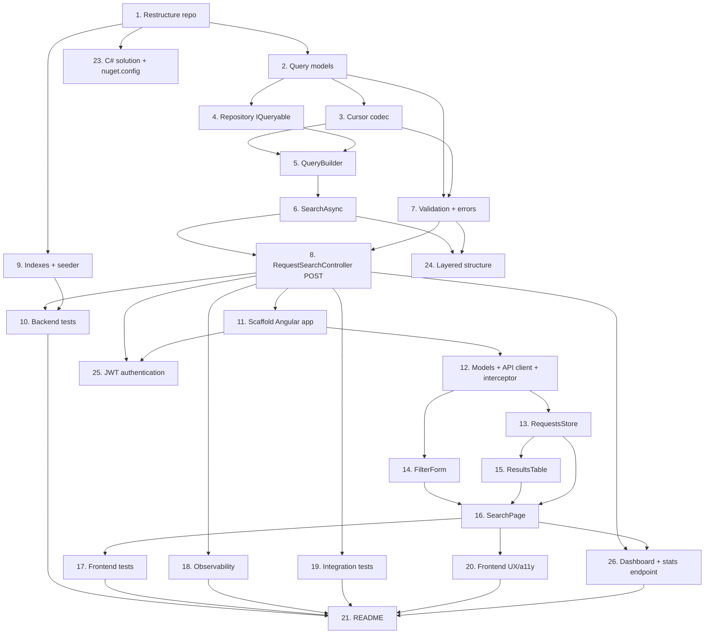

# Implementation Plan

## Overview

This plan implements the Requests Search and Filtering feature incrementally, backend first and then frontend, followed by documentation. Backend tasks build from data models outward to the endpoint, wiring authorization, filtering, sorting, and keyset pagination into a single database-level query. Each backend capability is validated with focused tests. The frontend is scaffolded once the API contract exists, then built as a smart container with presentational components over a signal-based store. Tasks are ordered so that each step builds only on completed work.

The backend follows the wider platform's conventions: a C# solution (`Backend/Requests.sln`) runnable from Visual Studio; a layered structure with per-domain controllers over a service layer (`Interfaces`/`Implementations`/`Models`/`Pagination`/`Validation`/`Mapping`) and a `Binder` per layer; search criteria supplied in the request body via `POST /api/requests/search`; a dedicated validator that validates and parses the criteria (`RequestQueryValidator`); and an explicit `Select` projection over `IQueryable` for entity→DTO mapping.

## Tasks

### Backend

- [x] 1. Reorganize the repository into `Backend/` and `Frontend/` top-level folders
  - Move the existing `src/` and `tests/` trees under `Backend/`.
  - Update project references and relative paths so the solution builds from the new location.
  - Verify with `dotnet build` and `dotnet test` that the relocated backend compiles and existing tests pass.
  - _Requirements: (project structure)_

- [x] 2. Add search query models to the Application layer
  - Add `SortField` and `SortDirection` enums.
  - Add the `RequestQuery` record (request number, statuses, request type, date range, sort, page size, cursor).
  - Add the `Cursor` record and the `PagedResult<T>` record.
  - _Requirements: 5, 7, 9_

- [x] 3. Implement the cursor codec
  - [x] 3.1 Implement `CursorCodec` with `Encode`/`Decode` to and from Base64url
    - Encode the sort field, sort direction, last sort value, and last id.
    - On decode failure or sort mismatch, surface a distinct error the validator can map to HTTP 400.
    - _Requirements: 7.9, 7.10_
  - [x] 3.2 Write unit tests for cursor round-trip and malformed/sort-mismatched cursors
    - _Requirements: 7.9, 7.10_

- [x] 4. Extend the repository to expose `IQueryable<Request>`
  - Add `Query()` returning `_db.Requests.AsNoTracking()` to `IRequestRepository` and its implementation.
  - _Requirements: 7.1, 10.4_

- [x] 5. Implement `RequestQueryBuilder` composition
  - [x] 5.1 Implement `ApplyAuthorization` (owner/assignee predicate for regular users; pass-through for admin)
    - _Requirements: 6.1, 6.2, 6.3_
  - [x] 5.2 Implement `ApplyFilters` for request number, statuses, request type, and date range
    - Add a filter condition only when the corresponding parameter is supplied.
    - Use `EF.Functions.Like` for a case-insensitive, collation-independent partial match on request number.
    - _Requirements: 1, 2, 3, 4, 10.1_
  - [x] 5.3 Implement `ApplySort` for all sort fields with `Id` as the tie-breaker; default `CreatedAt` descending
    - _Requirements: 5.1, 5.2, 5.3, 5.4_
  - [x] 5.4 Implement `ApplyKeyset` with the composite seek predicate per sort field and direction
    - _Requirements: 7.2, 7.3, 7.4_

- [x] 6. Implement `RequestService.SearchAsync`
  - Compose authorization, filters, sort, and keyset into one `IQueryable`.
  - Project directly to `RequestDto` via `Select`, fetch `PageSize + 1` rows, trim, and compute `nextCursor`.
  - Expose `SearchAsync` on `IRequestService`; an empty `RequestQuery` yields the first authorized page.
  - _Requirements: 6.4, 7.5, 7.6, 9.1, 9.3, 9.5, 10.2, 10.3, 10.5_

- [x] 7. Implement query validation and error envelope
  - [x] 7.1 Implement `RequestQueryValidator` mapping raw parameters to `RequestQuery`, collecting all errors
    - Validate status, type, sort field/direction, date parsing, inverted range, page-size bounds, and cursor.
    - Normalize supplied dates to UTC before comparison.
    - _Requirements: 2.5, 3.5, 3.6, 3.7, 4.3, 5.5, 5.6, 7.8, 8.1, 8.2, 8.3_
  - [x] 7.2 Add global exception-handling middleware returning HTTP 500 with `ProblemDetails` and no internal details
    - _Requirements: 8.4_

- [x] 8. Implement `RequestSearchController` (POST) and configure CORS
  - Add a thin `BaseController` (in `Controllers/Common`) exposing the caller identity from the authenticated JWT claims (subject id and `is_admin`).
  - Add `RequestSearchController` at `POST /api/requests/search` marked `[Authorize]`: bind the `RequestSearchRequest` body, run the validator, return `ValidationProblem` on errors, else call `SearchAsync` and return `PagedResult<RequestDto>`.
  - Rely on `[ApiController]` for automatic model-state 400s (`ValidationProblemDetails`).
  - Add a CORS policy in `Program.cs` allowing the Frontend origin (from configuration), the `GET` and `POST` methods, and the `Content-Type`/`Authorization` headers.
  - _Requirements: 6.5, 6.6, 8.2, 9.1, 9.4, 9.6, 9.7_

- [x] 9. Define indexes and update the seeder
  - Configure composite indexes `(OwnerId, CreatedAt, Id)` and `(AssignedToUserId, CreatedAt, Id)`, plus single-column indexes for `Status`, `RequestType`, and `RequestNumber`.
  - Ensure seeded data covers all statuses, types, owners, and assignees for meaningful test scenarios.
  - _Requirements: 7.7_

- [x] 10. Write backend tests for the search behavior
  - Authorization scoping (regular vs admin; parameters never widen the set), with dedicated unit coverage in `RequestAuthorizationTests`: owner-only, assignee-only, neither-owner-nor-assignee, admin-sees-all (including unassigned), and authorization enforced *before* filtering so a filter cannot leak another user's rows.
  - Combined filtering as a conjunction.
  - Keyset traversal completeness (no duplicates, no gaps; null `nextCursor` on the last page).
  - A cursor with an unparseable `CreatedAt` value surfaces as a Malformed `CursorException` (defense-in-depth for the keyset seek), not an unhandled exception.
  - Invalid input returns 400 reporting all invalid parameters together.
  - _Requirements: 16.1, 16.2, 16.3, 16.5_

### Frontend

- [x] 11. Scaffold the Angular 20 application under `Frontend/`
  - Create the standalone Angular 20 app with OnPush defaults.
  - Add PrimeNG and @ngx-translate; configure the English (LTR) translation file (`en.json`).
  - Add environment configuration for the API base URL.
  - Replace the framework-default favicon with a custom SVG favicon for the Requests product.
  - _Requirements: 15.1, 15.4, 15.6, 15.7, 15.8_

- [x] 12. Implement models, API client, and the auth interceptor
  - [x] 12.1 Add TypeScript models (`RequestDto`, `RequestQuery`, `PagedResult`, status/type/sort enums)
    - _Requirements: 9.2, 14.1, 14.2, 14.3_
  - [x] 12.2 Implement `RequestsApiClient` calling `POST /api/requests/search` and mapping the paged response
    - _Requirements: 9.1, 11.2_
  - [x] 12.3 Implement an HTTP interceptor attaching the `Authorization: Bearer` token (see Task 25)
    - _Requirements: 6.5, 6.6_

- [x] 13. Implement the signal-based `RequestsStore`
  - Signals for items, status, and next cursor; computed `hasMore` and `isEmpty`.
  - `search`, `loadMore`, and `retry` methods with `takeUntilDestroyed` cleanup.
  - _Requirements: 13.5, 15.3_

- [x] 14. Implement the `FilterForm` presentational component
  - Reactive form with request number, status multi-select, request type, and date range.
  - Cross-field validator (`createdFrom <= createdTo`) that blocks submission.
  - Signal output emitting the assembled `RequestQuery`; options sourced from enums only.
  - _Requirements: 11.1, 11.4, 11.5, 14.1, 14.2, 14.3, 14.4, 15.2_

- [x] 15. Implement the `ResultsTable` presentational component
  - Columns for request number, status, type, and created date, with i18n labels.
  - Status color indication and sortable column headers emitting `sortChange`.
  - Load-more control emitting `loadMore` when `hasMore`.
  - OnPush with signal inputs and outputs.
  - _Requirements: 12.1, 12.2, 12.3, 12.4, 12.5, 15.2_

- [x] 16. Implement the `SearchPage` smart container
  - Wire the store to the filter form and results table.
  - Render loading, error (with retry), empty, and results states via the new control flow.
  - Reset paging when the filter or sort changes; append pages on load-more.
  - _Requirements: 11.2, 11.3, 13.1, 13.2, 13.3, 13.4, 15.2_

- [x] 17. Write frontend tests
  - `RequestsStore` state transitions and cursor-based load-more.
  - `FilterForm` date-range validation.
  - `SearchPage` rendering across loading/error/empty/results states.
  - _Requirements: 16.6_

### Production-Readiness

- [x] 18. Add backend observability
  - Add a `/health` endpoint via ASP.NET Core Health Checks.
  - Add Serilog structured logging with request logging.
  - Enrich Swagger with parameter descriptions, response types, and error shapes.
  - _Requirements: 17.1, 17.2, 17.3, 17.4_

- [x] 19. Add backend API integration tests
  - Use `WebApplicationFactory` to test the endpoint end-to-end: authorization scoping, a combined-filter query, keyset paging across pages, and a 400 for invalid input.
  - _Requirements: 16.1, 16.2, 16.3, 16.5_

- [x] 20. Polish frontend UX and accessibility
  - Debounce filter input; show a non-blocking skeleton/spinner during requests.
  - Add labels, keyboard operability, and ARIA to the filter controls and results table; ensure responsive layout.
  - _Requirements: 18.1, 18.2, 18.3, 18.4_

### Documentation

- [x] 21. Write the README
  - How to run the backend and frontend locally, how to authenticate (register/login), and how to run both test suites (`dotnet test`, `npm test`).
  - Technologies chosen and why; assumptions; and the keyset-vs-offset and InMemory-provider tradeoffs.
  - _Requirements: 16.7_

### Platform Conventions

- [x] 23. Add a C# solution runnable from Visual Studio
  - Add `Backend/Requests.sln` including all four source projects and the test project.
  - Configure the `Requests.Api` launch profile (IIS Express) to open Swagger; HTTPS on a port in the IIS Express SSL-cert range (`44301`), HTTP on `60702`.
  - Add a `Backend/nuget.config` that clears inherited feeds and restricts restore to the public `nuget.org` gallery.
  - _Requirements: 19.1, 19.2, 19.3, 19.4, 19.5_

- [x] 24. Adopt the platform's layered structure and libraries
  - Organize the Application layer into `Interfaces`, `Implementations`, `Models`, `Pagination`, and `Validation`, with a `Binder` (`UseApplication`) per layer and a matching `UseInfrastructure` binder.
  - Add the `RequestQueryValidator` that validates and parses raw search criteria into a `RequestQuery`, collecting all errors.
  - Map `Request` → `RequestDto` with an explicit `Select` projection over `IQueryable` in `RequestService` (translatable to a single data-store query; no object-mapping library).
  - _Requirements: (platform conventions)_

### Authentication

- [x] 25. Add JWT authentication (backend and frontend)
  - Backend: add a `User` entity and `Users` DbSet (unique username index); a PBKDF2 `PasswordHasher` (no external package); `IAuthService`/`AuthService`, `IUserRepository`/`UserRepository`, and `ITokenService`/`JwtTokenService`; `AuthController` with `POST /api/auth/register` and `/api/auth/login`; bind `JwtSettings` and add JWT bearer validation in `Program.cs`; mark `RequestSearchController` `[Authorize]` and read identity from claims in `BaseController`; seed a default admin from `Seed:Admin`.
  - Frontend: add a signal-based `AuthService` (token persisted to `localStorage`), an auth HTTP interceptor attaching `Authorization: Bearer`, an `authGuard`, and an auth page toggling login/register; greet the signed-in user and provide logout.
  - _Requirements: 6.5, 6.6, 20.1, 20.2, 20.3, 20.4, 20.5, 20.6, 20.7, 20.8_

### Dashboard

- [x] 26. Add the dashboard overview with aggregate stats and drill-down
  - Backend: add `POST /api/requests/stats` (`RequestStatsController`, `[Authorize]`) and `RequestService.StatsAsync`, grouping the authorized set by status and type at the DB level, including zero-count buckets and a total; add xUnit tests for the aggregation and authorization scoping.
  - Frontend: split the Requests screen into search and dashboard tabs (`RequestsHomeComponent`); add `RequestsDashboardComponent` with two doughnut charts (PrimeNG `p-chart` over Chart.js), KPI cards, and a progress bar, loaded from a single `RequestsStatsService` call; wire chart-slice drill-down to switch to the search tab with a matching status/type filter via a `drillFilter` input.
  - _Requirements: 21.1, 21.2, 21.3, 21.4, 21.5, 21.6, 21.7, 21.8_

## Task Dependency Graph

```json
{
  "tasks": {
    "1": { "dependencies": [] },
    "2": { "dependencies": ["1"] },
    "3": { "dependencies": ["2"] },
    "4": { "dependencies": ["2"] },
    "5": { "dependencies": ["3", "4"] },
    "6": { "dependencies": ["5"] },
    "7": { "dependencies": ["2", "3"] },
    "8": { "dependencies": ["6", "7"] },
    "9": { "dependencies": ["1"] },
    "10": { "dependencies": ["8", "9"] },
    "11": { "dependencies": ["8"] },
    "12": { "dependencies": ["11"] },
    "13": { "dependencies": ["12"] },
    "14": { "dependencies": ["12"] },
    "15": { "dependencies": ["13"] },
    "16": { "dependencies": ["13", "14", "15"] },
    "17": { "dependencies": ["16"] },
    "18": { "dependencies": ["8"] },
    "19": { "dependencies": ["8"] },
    "20": { "dependencies": ["16"] },
    "21": { "dependencies": ["10", "17", "18", "19", "20", "26"] },
    "23": { "dependencies": ["1"] },
    "24": { "dependencies": ["6", "7"] },
    "25": { "dependencies": ["8", "11"] },
    "26": { "dependencies": ["8", "16"] }
  },
  "waves": [
    { "wave": 1, "tasks": ["1"] },
    { "wave": 2, "tasks": ["2", "9", "23"] },
    { "wave": 3, "tasks": ["3", "4"] },
    { "wave": 4, "tasks": ["5", "7"] },
    { "wave": 5, "tasks": ["6"] },
    { "wave": 6, "tasks": ["8", "24"] },
    { "wave": 7, "tasks": ["10", "11", "18", "19"] },
    { "wave": 8, "tasks": ["12", "25"] },
    { "wave": 9, "tasks": ["13", "14"] },
    { "wave": 10, "tasks": ["15"] },
    { "wave": 11, "tasks": ["16"] },
    { "wave": 12, "tasks": ["17", "20", "26"] },
    { "wave": 13, "tasks": ["21"] }
  ]
}
```



## Notes

- Backend and frontend are largely independent after Task 8: once the API contract is in place, frontend tasks (11–17, 20) can proceed in parallel with backend hardening (18, 19).
- Tests are colocated with the capabilities they cover; the cursor tests (3.2) run immediately after the codec, while broader behavior tests (10, 17, 19) run after the endpoint and UI exist.
- The EF Core InMemory provider is retained; index definitions (Task 9) are written for translation on a real relational provider and documented as a tradeoff in the README.
- The production-readiness tasks (18–20) are scoped deliberately: observability, integration tests, and UX/accessibility polish — each justified rather than added by default.
- All identifiers, comments, and UI strings follow the conventions in the design: English identifiers, i18n keys for user-facing text, and no hardcoded URLs or business-rule numbers.
- Tasks 23–24 capture the platform-alignment work: a Visual-Studio-runnable C# solution restricted to the public NuGet gallery, and the layered structure. They can proceed alongside the core backend once their prerequisites are met.
