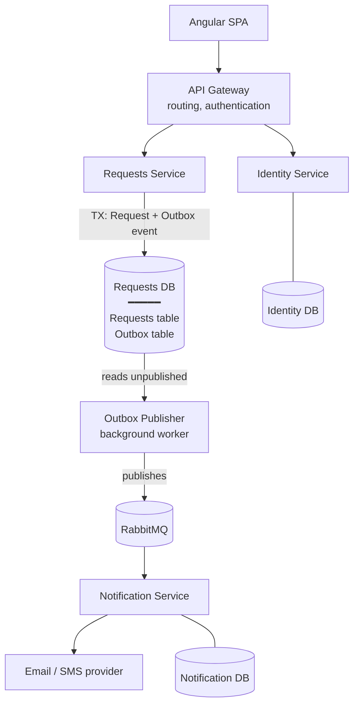
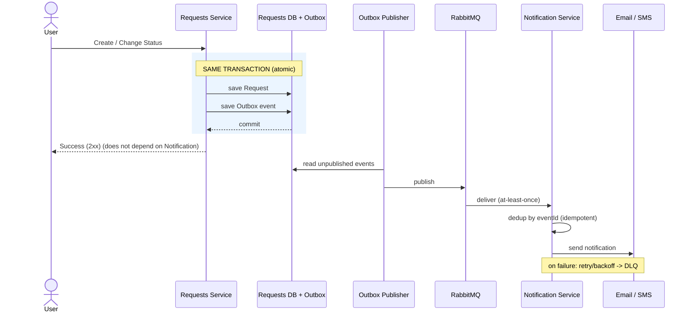

# חלק ב' — תכנון ארכיטקטורה: מעבר ל-Microservices

מסמך קצר העונה על שתי השאלות: (1) חלוקה אפשרית ל-Microservices והתועלות; (2) כיצד לתכנן תקשורת אמינה לתרחיש ה-Notification כשהשירות עלול להיות זמנית לא זמין.

**עיקרון מנחה:** לפרק לפי **Bounded Contexts** (אחריות עסקית) — לא לפי שכבות טכניות. שירות שמתפרק נכון אפשר לפתח, לפרוס ולהגדיל (scale) בנפרד.

---

## 1. Architecture Overview

החץ מראה שה-**Outbox Publisher קורא** את ה-events מטבלת ה-Outbox ומפרסם ל-RabbitMQ — ה-DB עצמו אינו "שולח" הודעות.

> Analytics / Stats service — **optional**, יחולץ ל-read-model נפרד רק אם עומס האנליטיקה יצדיק הפרדה. עד אז הוא נשאר בתוך Requests Service.

### חלוקת השירותים

| Service | אחריות | ה-DB שלו |
|---|---|---|
| **Requests** | יצירה, עדכון, וחיפוש/סינון של Requests (ה-core). | Requests DB + טבלת Outbox |
| **Identity** | משתמשים, Authentication, הנפקת/אימות JWT, הרשאות. | Identity DB |
| **Notification** | שליחת Notifications (email/SMS), retry וניהול כשלים. | Notification DB |
| **API Gateway** | נקודת כניסה אחת: routing ו-authentication (ובהמשך גם cross-cutting כמו rate-limiting). | — (stateless) |

עיקרון מרכזי: **Database per service** — לכל שירות ה-DB שלו, ואין גישה ישירה ל-DB של שירות אחר. שיתוף מידע נעשה דרך API או events בלבד.

### תועלות

- **Scaling ממוקד** — מגדילים רק את Requests (עומס החיפוש) בלי להכפיל את Identity/Notification.
- **Fault isolation** — נפילת Notification לא מונעת יצירת Request (ראו חלק 2).
- **Deploy עצמאי** — כל צוות משחרר בנפרד, בלי תיאום deploy.
- **הרחבה בלי לגעת ב-core** — צרכן events חדש (למשל Audit) לא דורש שינוי ב-Requests.

---

## 2. Reliable Notification

**הדרישה:** כש-Request נוצר או משנה Status → לשלוח Notification, ושירות ה-Notification עלול להיות זמנית לא זמין.

**העיקרון:** המטרה היא ש**יצירת/עדכון Request לא תהיה תלויה בזמינות של Notification**. לכן Requests **לא קורא ל-Notification סינכרונית** — אלא מפרסם event, ו-Notification צורך אותו בזמנו שלו. ה-broker סופג את חוסר-הזמינות.

הנקודה המרכזית נראית ישירות בתרשים: ה-Request וה-event נשמרים **באותה טרנזקציה**, התגובה ללקוח (Success / 2xx) חוזרת בלי להמתין ל-Notification, וה-Outbox Publisher מפרסם משם והלאה.

בקצרה: שמירה אטומית של Request + event ב-Outbox → Publisher מפרסם ל-RabbitMQ → Notification צורך; אם לא זמין, ה-event נשאר ב-broker עד שיחזור. ה-consumer idempotent (dedup לפי `eventId`), ובכשל עיבוד — retry/backoff ואז DLQ.

### למה זה אמין בכשלים השונים

| כשל | מה קורה |
|---|---|
| **Notification down** | ה-events מצטברים ב-RabbitMQ; יצירת ה-Request מצליחה; ההתראות נשלחות כש-Notification חוזר. |
| **RabbitMQ down** | ה-event נשאר ב-**Outbox**; ה-Publisher מפרסם אותו כש-ה-broker חוזר. ה-Request אינו תלוי בזמינות ה-broker. |
| **Redelivery (at-least-once)** | ה-idempotency מזהה event שכבר טופל → אין שליחה כפולה. |

> **Dual-write:** בלי Outbox אי אפשר לשמור ל-DB ולפרסם ל-broker אטומית — crash בין השניים גורם ל-Request בלי event או להפך. ה-Outbox פותר זאת בכך שהפרסום נגזר משורת DB שנשמרה באותה טרנזקציה.

> **ספק חיצוני:** מול ה-email/SMS provider אפשר להחיל resilience policies — timeout, retry with backoff, ו-circuit breaker — אבל זה concern משני, לא מרכז הפתרון.

**השורה התחתונה:** יצירת/עדכון Request אינה תלויה בזמינות של Notification. השילוב Outbox + Broker + Idempotency + Retry/DLQ **מונע אובדן events בתרחישי כשל זמניים**, בכפוף לעמידות ולתצורה של ה-DB וה-broker (DR, גיבויים, ו-monitoring ל-DLQ נותרים concern נפרד).

---

## 3. Trade-offs

Microservices מאפשרים scaling ו-deployment עצמאיים ו-fault isolation, אך מוסיפים מורכבות תפעולית, תקשורת רשת, eventual consistency וקושי ב-debugging מבוזר. לכן הייתי מפריד שירותים לפי גבולות עסקיים ברורים ולא מפרק את המערכת ללא צורך — ומתחיל בחילוץ הדרגתי (Notification תחילה, הגבול הברור ביותר), לא ב-big-bang.

## 4. Messaging Decision

בחרתי ב-**RabbitMQ** כדוגמה ל-message broker משום שהתרחיש דורש reliable asynchronous messaging עם queues, retry ו-DLQ. **Kafka** היא חלופה טובה כאשר נדרש event streaming ו-replay בהיקפים גבוהים (וגם מתאים אם Analytics יצרוך את אותם events); **Azure Service Bus / Amazon SQS** מתאימים כאשר המערכת כבר מבוססת Azure / AWS בהתאמה.
